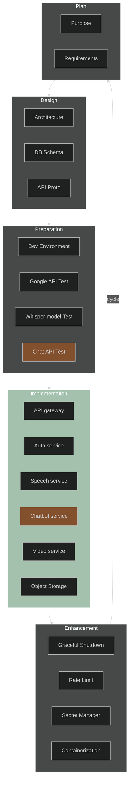
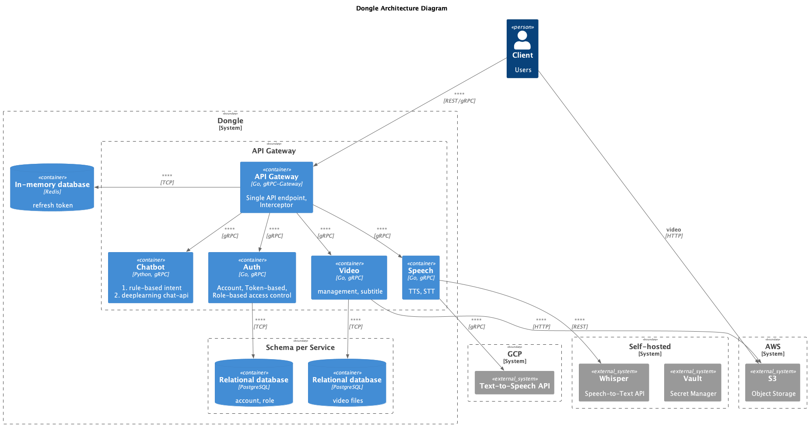

# Dongle
이번 cycle은 다음 cycle을 위한 환경 구축, 아키텍처, 기술 적용으로 준비 단계<br>
- 인증
- Speech 서비스
- 동영상 자막 서비스<br>


**목차**
- [1. Work Cycle](#1-work-cycle)
- [2. Directory Layout](#2-directory-layout)
- [3. Architecture](#3-architecture)
- [4. Tech Stack](#4-tech-stack)
    - [4.1 Services](#41-services)
    - [4.2 Operation and Deployment](#42-operation-and-deployment)
- [5. Additional Info](#5-additional-info)
    - [5.1 Subproject List](#51-subproject-list)
    - [5.2 OSS List](#52-oss-list)
---
<br><br><br>


## 1. Work Cycle
<span style="color:#A3C1AD">**Color Block** : </span>In progress<br>
<span style="color:#83502E">**Color Block** : </span>Skip

<!-- theme [default, neutral, dark, forest, base] -->

<br><br><br>


## 2. Directory Layout

```bash
.
├── README.md
├── go.mod
├── api # OpenAPI, DB schema, protocol definition
│   ├── db-schema
│   └── proto
│       ├── gen
│       │   └── go
│       │       ├── authpb
│       │       └── speechpb
│       ├── protos
│       │   └── google
│       │       ├── api
│       │       └── protobuf
│       └── scripts
├── app # Main Applications for this project
│   ├── api_gateway
│   │   └── server
│   │       ├── auth
│   │       └── speech
│   │       
│   ├── auth
│   │   └── server
│   └── speech
│       └── server
│           ├── google
│           └── whisper
├── build # Packaging and Continuous Integration.
│   ├── ci
│   └── package
├── deploy # Deployment configurations and templates
│   └── compose
├── docs # Design documents
│   └── architecture
├── internal # Internal packages
│   └── utils
│       └── env
├── test # test apps and test data.
│   └── speech
└── tools # Supporting tools for this project
    └── devcontainer

``````
<br><br><br>


## 3. Architecture




## 4. Tech Stack

### 4.1 Services

#### `API Gateway` (Go)
- gRPC Gateway

#### `Auth` (Go)
- Database
    - PostgreSQL
- Token-based
    - Redis : refresh token
- RBAC (Role-based access control)
    -   admin / manager / user

#### `Chatbot` (Python)
- Matching Intent
    - 1: rule-based csv definition
    - 2: deeplearning chat-api
#### `Video` (Go)
- Managing Unstructed data
    - object storage: minio -> S3

#### `Speech` (Go)
- TTS/STT
    - Google
    - Whisper
<br><br>


### 4.2 Operation and Deployment

#### `CI/CD`
- Github Action
- Buildah or Kaniko
#### `Deployment`
- Compose
- AWS, Terrafrom
<br><br><br>
###


## 5. Additional Info


### 5.1 Subproject List
| Repository                             | Desc                                 |
| :------------------------------------- | :----------------------------------- |
| https://github.com/kimsehyoung/logger  | Go Logging package using logrus      |
| https://github.com/kimsehyoung/whisper | STT API server using whisper package |
|                                        |                                      |


### 5.2 OSS List

| OSS                | License               | Desc                                 | Link                                            |
| :----------------- | :-------------------- | :----------------------------------- | :---------------------------------------------- |
| protobuf           | BSD-3-Clause          | Google's data interchange format     | https://github.com/protocolbuffers/protobuf-go  |
| grpc               | Apache-2.0            | HTTP/2 based RPC                     | https://github.com/grpc/grpc-go                 |
| grpc-gateway       | BSD-3-Clause          | RESTful API into gRPC                | https://github.com/grpc-ecosystem/grpc-gateway  |
| go-grpc-middleware | Apache-2.0            | Go gRPC interceptor auth, logging... | https://github.com/grpc-ecosystem/go-grpc-middleware/v2 |
| validator          | MIT                   | Go Struct and Field validation       | https://github.com/go-playground/validator      |
| postgres           | similar to BSD or MIT | RDBMS                                | https://github.com/postgres/postgres            |
| ent                | Apache-2.0            | An entity framework for Go           | https://github.com/ent/ent                      |
| pgx                | MIT                   | PostgreSQL driver for Go             | https://github.com/jackc/pgx                    |
| redis              | BSD-3-Clause          | key-value in-memory database         | https://github.com/redis/redis                  |
| jwt                | MIT                   | go implementation of JSON Web Tokens | https://github.com/golang-jwt/jwt               |


