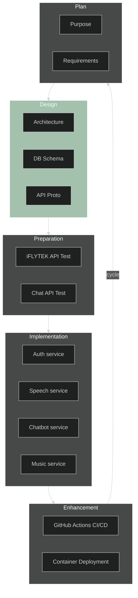

# Dongle

이후 진행될 work cycle을 위한 설계, 환경 구축, 기술 적용 단계<br>
MSA로 유연하게 변경/확장 가능<br><br>


**목차**
- [1. Work Cycle](#1-work-cycle)
- [2. Directory Layout](#2-directory-layout)
- [3. SW Architecture](#3-sw-architecture) 
- [4. Tech Stack](#4-tech-stack)
    - [4.1 Services](#41-services)
    - [4.2 Operation and Deployment](#42-operation-and-deployment)
- [5. Open Source List](#5-open-source-list)
---
<br><br><br>


## 1. Work Cycle
<span style="color:#A3C1AD">**Color Block** : </span>In progress

<!-- theme [default, neutral, dark, forest, base] -->

<br><br><br>


## 2. Directory Layout

```bash
.
├── api # OpenAPI, DB schema, protocol definition
│   ├── db-schema
│   └── proto
│       ├── gen
│       │   ├── go
│       │   └── python
│       └── protos
├── app # Main Applications for this project
│   ├── auth
│   ├── chatbot
│   ├── music
│   └── speech
├── docs # Design documents
│   └── architecture
└── tools # Supporting tools for this project
    └── dev_env
``````
<br><br><br>


## 3. SW Architecture
Patterns
- API Gateway
- Datbase per Service
<br><br><br>


## 4. Tech Stack

### 4.1 Services

#### `API Gateway` (Golang)
- gRPC Gateway

#### `Auth` (Golang)
- Account
    - MySQL or PostgreSQL
- Token-based
    - Redis : refresh token
- RBAC (Role-based access control)
    -   admin / user

#### `Chatbot` (Python)
- Matching Intent
    - 1: rule-based csv definition
    - 2: deeplearning chat-api
#### `Music` (Golang)
- Managing Unstructed data
    - Minio: object storage -> S3

#### `Speech` (Python)
- TTS/STT
    - iFLYTEK
<br><br>


### 4.2 Operation and Deployment

#### `CI/CD`
- Github Action
- Buildah or Kaniko
#### `Deployment`
- Podman
<br><br><br>


## 5. Open Source List